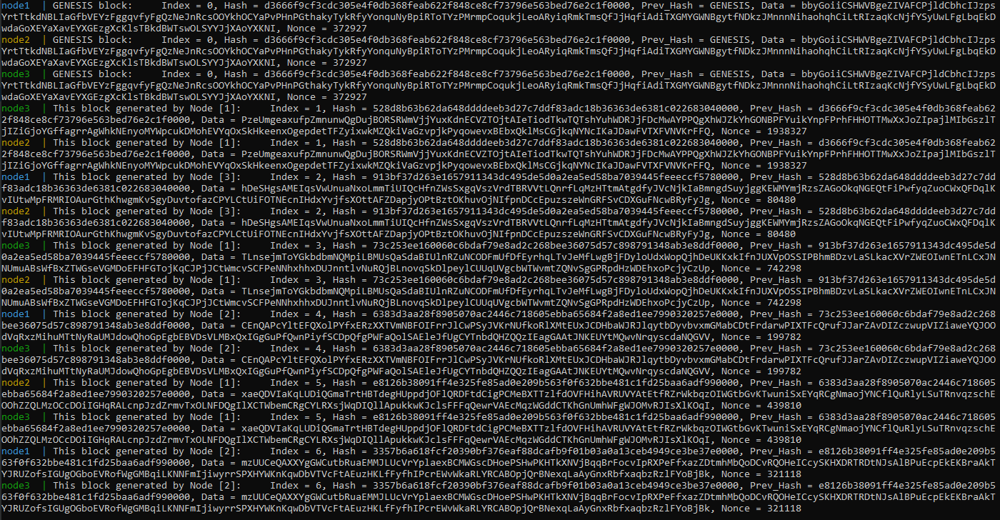

# Blockchain

Простой Blockchain на Python с использованием фреймворка Flask.

В Blockchain реализованы две сущности:
- **block** - класс для генерации блоков цепочки блокчейна, состоящих из следующих полей:
    - **index** - номер блока по возрастанию, начиная с 0 у `GENESIS`.
    - **hash** - хеш текущего блока, который вычисляется путем конкатенации полей `index`, `prev_hash`, `data`, `nonce` (в качестве хеш-функции используется sha256)
    - **prev_hash** - хеш предыдущего блока.
    - **data** - данные, которые являются случайной строчкой из 256 символов.
    - **nonce** - это дополнение, за счет изменения которого можно пересчитывать `hash`.
- **node** - класс текущей node/сервера, который хранит в себе информацию о цепочке блокчейна на данном сервере и содержит функцию для обработки нового блока. В случае добавления при помощи еще одной функции этот блок будет распечатан.

Серверное взаимодействие осуществляется путем передачи сгенерированных блоков между тремя нодами. Генерация происходит бесконечно после получения блока GENESIS.


## Запуск проекта

Клонируем проект 

```git clone https://github.com/AntunovichPYU/BlockChain.git```

В папке с проектом собираем образ

```docker build -t pvl/blockchain:latest .```

Запускаем docker-compose

```docker-compose up```
## Демонстрация работы

В результате в командной строке выводится следующее:



